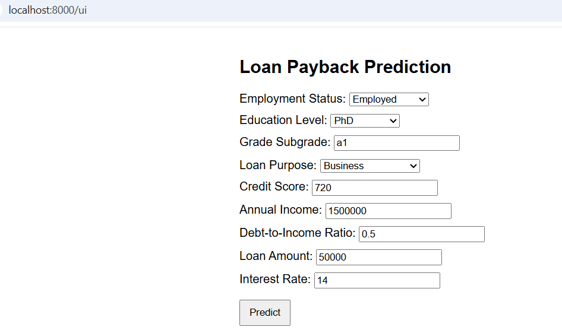
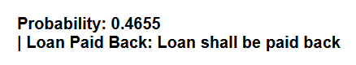
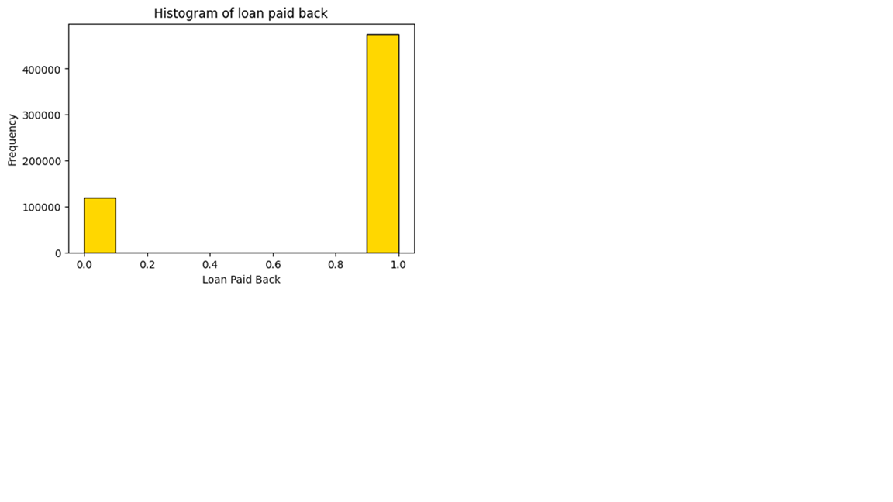
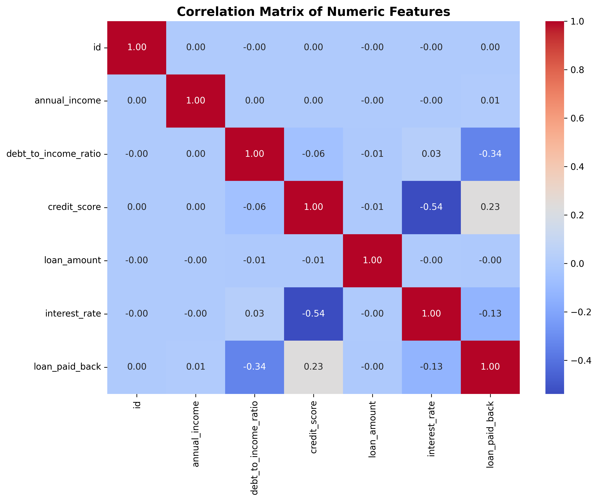

# Loan Payback Prediction using Machine Learning  
### Predicting whether Loan will be paid back with XGBoost & FastAPI | Dockerized & Deployed on Render

## Problem Description
Banks give several types of loans to customers, like home loan and personal loan. 
Before getting a loan, customers provide personal information such as Annual Income, Existing Debt, Age, Gender,Marital Status,  Employment Status, Education level etc.  Banks usually face the problem about unpaid and outstanding loans.  Banks can develop a ML application using the personal information provided by customer to predict the probability whether customer will pay back the loan or not .Then they can decide whether or not to lend the money to the prospective customer.

The objective of this project is to develop a machine learning–based Loan Payback Prediction system that predicts whether the borrower will payback the loan

The project includes:

- Data cleaning and preprocessing
- Exploratory Data Analysis (EDA)  
- Feature engineering and selection
- Model training and comparison (Logistic Regression, Decision Tree, Random Forest, XGBoost)  
- Hyperparameter tuning
- Training final model
- Deploying the model using FastAPI and Docker

The final solution is built using the XGBoost model as we got best AUC score and F1 score with this model

The model is deployed as a REST API using FastAPI, containerized using Docker, and hosted on Render for real-time inference.


## How the Solution Is Used

### 1. Transaction Prediction 

When a transaction is processed, its details are sent to the `/predict` endpoint. The API responds with loanpayback probability and classification. 

#### Example request:
```json
[
{
  "employment_status": "employed",
  "education_level": "bachelors",
  "grade_subgrade": "a1",
  "loan_purpose": "business",
  "credit_score": 720,
  "annual_income": 150000,
  "debt_to_income_ratio": 0.5,
  "loan_amount": 50000,
  "interest_rate": 14
}
]

  

#### Example Response
```json
{
  "loan_paid_back_probability": 0.4309,
  "loan_paid_back": "Loan will not be paid back"
}
```
Based on the model response:

| Prediction                      | Recommended Action       |
|---------------------------------|--------------------------|
| Loan will be paid back          | Approve the loan
| Loan will not be paid back      | Do not Approve the loan                         

### 1. Transaction Prediction through UI
When a transaction is processed, its details are sent to the `/ui` endpoint. The API responds with loanpayback probability and classification. 

#### Example request:
**Image in repository at:** `images/prediction_ui.png`


#### Example Response
**Image in repository at:** `images/response_ui.png`



### Summary of integration

- Supports real-time single Loan Payback prediction
- Enables batch loan payback prediction for multiple transactions
- Returns a probability score and final payback prediction
- Suitable for integration into live loan application systems or periodic reviews of customer
- Helps reduce bad and outstanding loans


```python

```

## Exploratory Data Analysis (EDA)

### 1. Dataset Overview

- **Total transactions:** `599,394`
- **Loan Paid Back Prediction:** `474,494` (~79.88%)
- **Loan not paid back Predictions:** `119,500` (~20.11%)
- **Missing values:** `None`

**Data source:** [Loan Payback Prediction Dataset(Kaggle)]  
(https://www.kaggle.com/competitions/playground-series-s5e11/data)


---

### 2. Feature Overview

| Feature Type | Features |
|--------------|----------|
| **Identifier** | `id`|
| **Numerical** | `annual_income`, `debt_to_income_ratio`, `credit_score`, `loan_amount`, `interest_rate` |
| **Categorical** | `gender`, `marital_status`, `education_level`, `employment_status`, `loan_purpose`, `grade_subgrade` (Education_level and grade_subgrade was tranformed to numeric using Ordinal encoding) |
| **Target variable** | `loan_paid_back` (0 = Customer defaults, 1 = Customer will pay back) |

---

### 3. Class Distribution (Class Imbalance)

The target variable is quite imbalanced:
- **Loan Paid Back:** `474,494`
- **Loan Not Paid Back:** `119,500`

**Image in repository at:** `images/class_distribution.png`




**Key insight:**
- Accuracy is not sufficient to judge the models → we focused on **ROC-AUC and F1-score**

### 4. Mutual Information (Categorical/Binary Features)

| Feature | MI Score |
|---------|----------|
| `employment_status` | 0.175941 |
| `grade_subgrade` | 0.026769 |
| `loan_purpose` | 0.000325 |
| `education_level` | 0.0048 |
| `gender ` | 0.000028 |
| `marital_status ` | 0.000003 |


**Insight:**
- Employment Status is a strong feature in dataset. It indicates whether customer will pay back the loan. Grade Subgrade is also a good feature
- Some features like loan_purpose and education_level have less influence, but can prove to be useful after encoding
- gender and marital status dont have much influence on loan payback intention hence these will be dropped

### 5. Correlation of Numeric Features

**Image in repository:** `images/correlation_matrix.png`



**Important correlations with `loan_paid_back`:**
- `debt_to_income_ratio` → 0.335758
- `credit_score` → 0.234319
- `interest_rate` → -0.130789

#### Interpretation:
* **High Credit Score** → Loan Paid Pack probability is higher 
* **Low Debt to Income ratio** → Loan Paid Pack probability is higher 
* **Lower interest rates** →Loan Paid Pack probability is higher 

## Feature Engineering

It was necessary to encode certain categorical features into numeric to improve model performance. Some features were dropped as they were not influencing the Loan Pay Back Variable.
The `FeatureEngineering` is implemented  **src/features.py**. This transformation is applied as the first step of the ML pipeline to ensure consistency during both training and inference.

### Key Transformations

| Feature | Description | Motivation |
|--------|-------------|------------|
| `education_level`|`education_encoded` | Education Level is encoded using the Ordinal encoder |
| `grade_subgrade` |`grade_code`| Grade Subgrade is encoded using the Ordinal Encoder |
| `loan_purpose` | loan_purpose_te |Loan Purpose is encoded using target encoder|
| **Dropped:** `id`| Removed unique identifiers | Prevent data leakage and overfitting |
| **Dropped:** `education_level`, `grade_subgrade`, `loan_purpose` | Replaced by encoded features | Avoid redundancy |
| **Dropped:** `marital_status`, `gender` | Has negligible impact on target variable loan_paid_back | feature reduction |

### Why This Matters

- Most machine-learning algorithms operate on numbers, not labels or strings.
- By converting education_level using ordinal encoder , it helps the model capture the inherent distance between various education levels
- By converting grade_subgrade using ordinal encoder, it helps model capture the distance between various grades.
- Loan Purpose was converted using target encoding because some loans like education and medical loan and riskier to give.
- Prevents **data leakage** by excluding unique identifiers
- Dropped columns like gender and marital status so that model can be built on important features.

### Pipeline Integration

The transformer is used as part of the final ML pipeline:

```python
pipeline = Pipeline(
    steps=[
        ("featureengineering", FeatureEngineering()),
        ("vectorizer", DictVectorizer(sparse=False)),
        ("model", final_model),  # XGBClassifier
    ]
)
```

## Model Training & Selection

The dataset was split into:
* 60% Training
* 20% Validation
* 20% Testing

Multiple models were trained using the training set and evaluated against the validation set. Hyperparameter tuning and threshold optimization were performed to maximize predictive performance, especially focusing on F1-score and ROC-AUC score for Loan Payback Prediction

### Models Evaluated

| Model | Tuned Parameters | Decision Threshold | ROC-AUC | Accuracy | F1 Score |
|-------|------------------|-------------------|---------|-----------|----------|
| Logistic Regression | `solver = lbfgs, C=1, max_iter=1000` | 0.4 | 0.909741 | 0.9016 | 0.941174 | 
| Decision Tree | `max_depth=10, min_samples_leaf=100, random_state=42` | 0.4 | 0.91415   | 0.901918  | 0.941701  |
| Random Forest | `max_depth=10, min_samples_leaf=20, n_estimators=300, n_jobs=-1, max_features=sqrt` | 0.55 | 0.912805 | 0.902701 | 0.941708 |
| XGBoost (Final) | `objective='binary:logistic', eval_metric='auc', subsample=1.0, n_estimators=450, min_child_weight=30, max_depth=6, learning_rate=0.1, n_jobs=-1, random_state=42` | 0.45 | 0.921519 | 0.904688 | 0.943001 |


```python

```

### Final Model Selection

After comparing performance across models, **XGBClassifier** was selected as the final production model based on the following:

* Highest ROC-AUC on validation  
* Best F1-score, indicating strong Loan Payback probability calculation 

### Final Model Evaluation (on Test Set)

After selecting XGBClassifier, the model was retrained using full train + testing datasets, and final evaluation was performed on the test set.

| Metric | Value |
|--------|-------|
| ROC-AUC | 0.9781 |
| F1 Score | 0.8025 |
| Decision Threshold | 0.80 |

## Exporting Notebook to Script

To comply with project requirements and ensure reproducibility, all essential machine learning steps developed in the notebook (`notebooks/notebook.ipynb`) were fully converted into Python scripts.

### Scripts Created

| Script | Purpose |
|--------|---------|
| `src/train.py` | Contains final model training pipeline and saves the trained model. |
| `src/predict.py` | Loads the trained model and serves predictions via a FastAPI REST endpoint. |
| `src/featureproc.py` | Implements the custom feature engineering logic. |

### What Was Exported from Notebook
The following core logic developed and validated in `notebooks/notebook.ipynb` was migrated into standalone scripts for production readiness:

| Exported Component | Implemented In | Description |
|-------------------|----------------|-------------|
| Data loading | `train.py` | Reads loan dataset from `data/train.csv`. |
| Feature engineering logic | `featureproc.py` | Custom transformer class `FeatureEngineering`. |
| Model training & hyperparameter tuning | `train.py` | Uses tuned XGBoost model parameters finalized from notebook experiments. |
| Decision threshold selection (`0.45`) | `train.py` | Threshold locked based on best F1 score from validation results. |
| Final model training | `train.py` | Trains full XGBoost model on entire training dataset. |
| Model serialization (pipeline + threshold) | `train.py` | Saved using `pickle` as `models/loanpayback_pipeline.bin`. |
| API-based prediction logic | `predict.py` | Loads trained pipeline and serves predictions via FastAPI. |

### Example: Model Saving in `train.py`
```python
model_path = "models/loanpayback_pipeline.bin"

with open(model_path, "wb") as f_out:
    pickle.dump({"pipeline": pipeline, "threshold": best_threshold}, f_out)


### 
Example: Model Loading in `predict.py`
```python
with open(MODEL_PATH, "rb") as f_in:
    model_data = pickle.load(f_in)

pipeline = model_data["pipeline"]
threshold = model_data["threshold"]
```

## Reproducibility

This project is fully reproducible. The dataset, notebook, and training scripts are included in the repository, allowing seamless re-execution.

- Dataset available in `data/train.csv`
- Full analysis in `notebooks/LoanPaybackNB.ipynb`
- Feature Training function in `src/featureproc.py`
- Final model training located in `src/train.py`
- Inference logic exposed via `src/predict.py`
- Trained pipeline saved at `models/loanpayback_pipeline.bin`


### How to Reproduce
```bash
# Install dependencies and set up environment
uv sync

# Run training script
uv run python -m src.train

# Start inference API
uv run uvicorn src.predict:app --reload --port 8000
```

---

## Model Deployment (Local)

The trained machine learning model is deployed locally using **FastAPI** and served via **Uvicorn**.

### Start API Locally
```bash
uv run uvicorn src.predict:app --reload --port 8000
```

Once the application is running:

- **Swagger UI (API documentation):** `http://localhost:8000/docs`
- **Root endpoint:** `http://localhost:8000/`

### Supported Features
- **Single loan prediction API (POST):** `/predict`
- **HTML-based UI for interactive prediction:** `/ui`
  
---

## Dependency & Environment Management

The project uses **uv** to manage dependencies and execution. All required packages are defined in `pyproject.toml` and `requirements.txt`.

### Install Dependencies
```bash
uv sync
```
### Example Execution Commands
```bash
uv run python -m src.train      # Train model
uv run uvicorn src.predict:app --reload --port 8000   # Launch API
```
---

## Dependency Files

### `requirements.txt`
```txt
fastapi==0.128.0
joblib==1.5.3
numpy==2.4.0
pandas==2.3.3
pydantic==2.12.5
pydantic_core==2.41.5
scikit-learn==1.8.0
scipy==1.16.3
seaborn==0.13.2
uv==0.9.21
uvicorn==0.40.0
xgboost==3.1.2

```

### `pyproject.toml`
```toml
[project]
name = "loanpayback"
version = "0.1.0"
description = "Loan Payback Predicion Project"
readme = "README.md"
requires-python = ">=3.12"
dependencies = [
    "fastapi>=0.128.0",
    "pandas>=2.3.3",
    "scikit-learn>=1.8.0",
    "uvicorn>=0.40.0",
    "xgboost>=3.1.2",
    "pydantic>=2.12.5",
    "pydantic_core>=2.41.5",
    "numpy>=2.4.0",
    "pandas>=2.3.3",
    "scipy==1.16.3",
    "notebook>=7.5.1",
]

[dependency-groups]
dev = [
    "requests>=2.32.5",
]

```
---

## Containerization (Docker)

The project is fully containerized using **Docker**, allowing consistent deployment across environments.
### Dockerfile Used
```dockerfile
# Use lightweight Python
FROM python:3.11-slim

# ==============================
# Environment settings
# ==============================
ENV PYTHONDONTWRITEBYTECODE=1
ENV PYTHONUNBUFFERED=1

# ==============================
# Working directory
# ==============================
WORKDIR /app

# ==============================
# System dependencies (XGBoost)
# ==============================
RUN apt-get update && apt-get install -y \
    build-essential \
    libgomp1 \
    && rm -rf /var/lib/apt/lists/*

# ==============================
# Python dependencies
# ==============================
COPY requirements.txt .
RUN pip install --no-cache-dir -r requirements.txt

# ==============================
# Copy only required files
# ==============================
COPY src ./src
COPY models ./models

# ==============================
# Expose API port
# ==============================
EXPOSE 8000

# ==============================
# Run FastAPI
# ==============================
CMD ["uvicorn", "src.predict:app", "--host", "0.0.0.0", "--port", "8000"]

```
---


### Build the Docker Image

Run the following command inside the project folder:
```bash
docker build --no-cache -t loanpayback-api .
```
---

### Run the Docker Container
```bash
docker run -p 8000:8000 loanpayback-api
```

Once started, the API will be available at:
- **Local URL** → `http://localhost:8000/docs/`
- **Swagger UI** → `http://localhost:8000/docs/`
---


## Cloud Deployment

The Loan Payback Prediction API is deployed on Render using FastAPI and Docker, enabling real-time loan repayment inference through RESTful endpoints.

### Deployment Steps (Docker + Render)

#### 1. Push complete project to GitHub
[github repo link]
(https://github.com/priyasea/LoanPayBack_Project)


#### 2. On Render Dashboard → “New Web Service”

#### 3. Select Deployment Settings

| Setting | Value |
|---------|-------|
| Environment |	Docker |
| Repository | `priyasea/LoanPayBack_Project` |
| Branch | main |
| Root Directory | `(leave empty)` |
| Environment Variables | `PORT=8000` |
| Instance Type | Free Tier |

#### 4. Click "Deploy Web Service"

Render automatically:

* Pulls repo

* Builds Docker image

* Runs FastAPI service using command from Dockerfile
```CSS
CMD ["uvicorn", "src.predict:app", "--host", "0.0.0.0", "--port", "8000"]
```
---


```python

```
